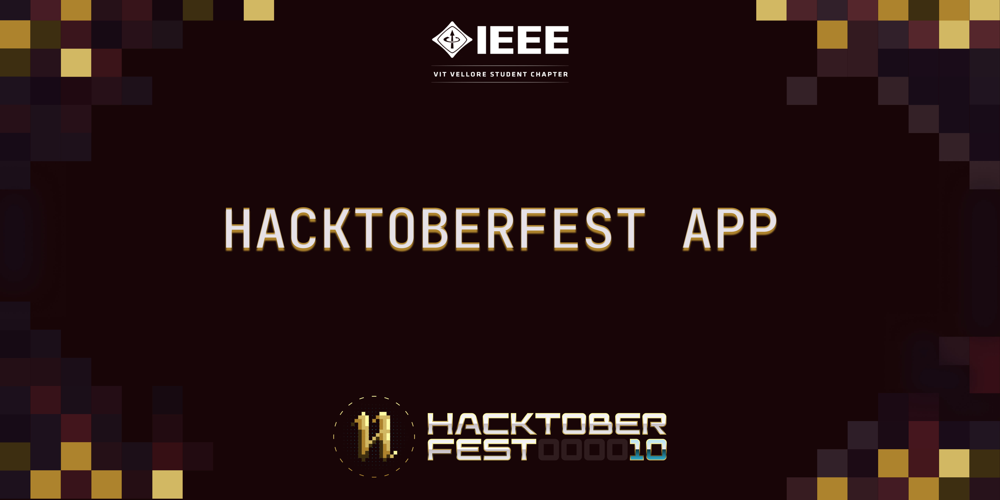

# Hacktoberfest 2023 with IEEE-VIT :heart:
\
\
This app aims to simplify the process of finding repositories on GitHub, view the various contributors to the repos, and also allows the user to become a contributor to the desired project.

Support open source software by participating in [Hacktoberfest](https://hacktoberfest.digitalocean.com) and get goodies :yellow_heart:

> Please check all issues labelled as `hacktoberfest` to start contributing!

Kindly consider leaving a :star: if you like the repository and our organisation.

## Getting Started
* Fork it.
* Clone your forked repo and move inside it:\
`git clone https://github.com/<your-github-username>/<repo-name>.git && cd <repo-name>`

* Checkout to a new branch to work on an issue:\
`git checkout -b my-amazing-feature`

* Now you can open the project.
* Run `flutter pub get` in the project terminal and get the dependencies.
* Use `flutter run debug` to run the app in your local emulator.
* Once you're all done coding, it's time to open a PR :)
Run the following commands from the root of the project directory:\
`git add .`\
`git commit -m "A short description about the feature."`\
`git push origin <my-amazing-feature>`

Open your forked repo in your browser and then raise a PR to the `master` branch of this repository!

## Contributing

To start contributing, check out [CONTRIBUTING.md](https://github.com/IEEE-VIT/hacktoberfest-flutter/blob/master/CONTRIBUTING.md). New contributors are always welcome to support this project. If you want something gentle to start with, check out issues labelled as `easy` or `good-first-issue` Check out issues labelled as `hacktoberfest` if you are up for some grabs! :) 

## License

This project is licensed under [MIT](https://github.com/IEEE-VIT/hacktoberfest-flutter/blob/master/LICENSE)
